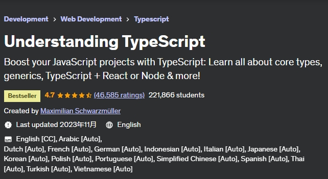

# 《Understanding TypeScript》Learning Notes


## 1. Profiles



> **Introduction**
>
> Learn what TypeScript is, why it really is a **powerful addition to JavaScript**, what its features are and how to use it! Learn why TypeScript is amazing, how it improves your JavaScript code and how it helps you avoid nasty bugs and errors!
>
> This course takes you from the **very basics** and its most **important feature** (types!) to the point where you're able to **use TypeScript in any of your projects**. **ReactJS** projects included!
>
> As TypeScript is developed by **Microsoft** and strongly advertised and used by **Angular 2+ (Google) and other popular libraries**, it's **here to stay**. Indeed, TypeScript is one of the most popular web development languages you can learn these days!
>
> **Gain an edge today and be amongst the first to really understand TypeScript!**
>
> Learn how you can use TypeScript to bring modern JS features like destructuring, arrow functions or classes to any environment and codebase - even if it does not support those features yet! Understand which types you may use and how you can build your own types. Learn how to write better code with types and with the many features offered by TypeScript!
>
> But, in this course, **we'll not stop after the basics**! You will also learn about more **advanced features** (like decorators) and also how to set up **workflows with TypeScript**. This includes a TypeScript-only workflow as well as a **webpack workflow**.
>
> You'll also learn that you're **not limited to Angular** or plain JavaScript/ TypeScript projects. Instead, a complete module covers how you may **use TypeScript with ReactJS** and improve your React code with TypeScript as well.
>
> **Practice what you learn!**
>
> Watching videos is a great way to learn. And to a lot of students, it's the best way. If you also want to practice the things you learn, this course offers you more than that though. Because this course comes with plenty of exercises (and solutions, of course) in addition to all the high-quality learning videos.
>
> **So much Content!**
>
> I'm not a fan of these courses which teach you the basics and then leave you alone. Instead, in this course you'll get insights into:
>
> - Types and how to use them
> - How the TypeScript compiler works (and how you may configure it)
> - ES6 features with TypeScript
> - Classes in TypeScript
> - Namespaces and modules
> - Interfaces
> - Generics
> - Decorators
> - How to integrate Third-Party JavaScript libraries into your TypeScript projects
> - How to set up a TypeScript project with webpack
> - Or how to set up a plain-TypeScript workflow
> - How to use TypeScript together with ReactJS
> - How to use TypeScript together with Node/ Express
> - Real projects and use-cases!
> - And so much more!
>
> **Who this course is for:**
>
> - This Course is for every student who wants to extend his or her horizon beyond vanilla JavaScript
> - Everyone learning Angular should definitely understand how TypeScript works


## 2. Outlines

Status available：:heavy_check_mark: (Completed) | :hourglass_flowing_sand: (Working) | :no_entry: (Not Started) | :orange_book: (Finish reading)

| No.  |                        Chapter Title                         |          Status          |
| :--: | :----------------------------------------------------------: | :----------------------: |
| S01  |                       Getting Started                        |    :heavy_check_mark:    |
| S02  |               TypeScript Basics & Basic Types                | :hourglass_flowing_sand: |
| S03  |       The TypeScript Compiler (and its configuration)        |        :no_entry:        |
| S04  |           Next-generation JavaScript & TypeScript            |        :no_entry:        |
| S05  |                     Classes & Interfaces                     |        :no_entry:        |
| S06  |                        Advanced Types                        |        :no_entry:        |
| S07  |                           Generics                           |        :no_entry:        |
| S08  |                          Decorators                          |        :no_entry:        |
| S09  |       Practice Time! Let's build a Drag & Drop Project       |        :no_entry:        |
| S10  |                     Modules & Namespaces                     |        :no_entry:        |
| S11  |                Using Webpack with TypeScript                 |        :no_entry:        |
| S12  |               3rd Party Libraries & TypeScript               |        :no_entry:        |
| S13  | Time to Practice! Let's build a "Select & Share a Place" App (incl. Google Maps) |        :no_entry:        |
| S14  |                    React.js & TypeScript                     |        :no_entry:        |
| S15  |                Node.js + Express & TypeScript                |        :no_entry:        |
| S16  |                        Course Roundup                        |        :no_entry:        |


Powershell script for generating markdown files in batch:

```powershell
# Create 13 empty markdown files named Ch##.md:
for($i=1; $i -le 13; $i=$i+1){ New-Item -Name "Ch$('{0:d2}' -f $i).md"; }
```

 
