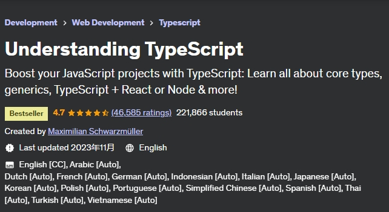
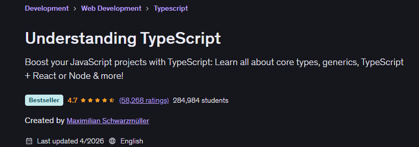

# 《Understanding TypeScript》Learning Notes


## 1. Profiles





> **Introduction**
>
> 2025 年 3 月大幅更新课程内容，新增 `10+` 小时的视频内容。目前包含 25 个章节，339 节内容，总时长 `22:32:00`。
>
> 实测版本：
>
> - `NodeJS`：`v20.16.0`
> - `TypeScript`：`v5.5`
> - `Bun`：`1.3.14`


## 2. Outlines

Status available： 

:heavy_check_mark: (Completed) | :hourglass_flowing_sand: (Working) | :no_entry: (Not Started) | :orange_book: (Finish Learning)

| No.  |                        Chapter Title                         |          Status          |
| :--: | :----------------------------------------------------------: | :----------------------: |
| S01 | Getting Started | :heavy_check_mark: |
| S02 | TypeScript Basics & Basic Types | :heavy_check_mark: |
| S03 | The TypeScript Compiler (and its Configuration) | :hourglass_flowing_sand: |
| S04 | TypeScript Essentials Demo Project | :no_entry: |
| S05 | Next-generation JavaScript & TypeScript | :no_entry: |
| S06 | Classes & Interfaces | :no_entry: |
| S07 | Advanced Types | :no_entry: |
| S08 | Generic Types | :no_entry: |
| S09 | Classes & Generics - Demo Project | :no_entry: |
| S10 | Deriving Types From Types | :no_entry: |
| S11 | ECMAScript Decorators | :no_entry: |
| S12 | Experimental Decorators | :no_entry: |
| S13 | Practice Time! Let's build a Drag & Drop Project | :no_entry: |
| S14 | Modules & Namespaces | :no_entry: |
| S15 | Creating & Running TypeScript Projects with Vite | :no_entry: |
| S16 | Using Webpack with TypeScript | :no_entry: |
| S17 | 3rd Party Libraries & TypeScript | :no_entry: |
| S18 | Time to Practice! Let's build a "Select & Share a Place" App (incl. Google Maps) | :no_entry: |
| S19 | React.js & TypeScript | :no_entry: |
| S20 | Node.js + Express & TypeScript | :no_entry: |
| S21 | Course Roundup | :no_entry: |
| S22 | [LEGACY] TypeScript Basics & Basic Types | :no_entry: |
| S23 | [LEGACY] The TypeScript Compiler (and its Configuration) | :no_entry: |
| S24 | [LEGACY] Classes & Interfaces | :no_entry: |
| S25 | [LEGACY] Generics | :no_entry: |


课程大纲生成脚本：

```js
const clsName = '.curriculum-section-module-scss-module__9JCrHq__section-title'
const titles = Array.from(document.querySelectorAll(clsName)).map(e => e.innerText.trim())
titles.map((t, i) => `| S${String(i+1).padStart(2,'0')} | ${t} | :no_entry: |`).join('\n')
// 放到 SublimeText 批量替换 \n
```

