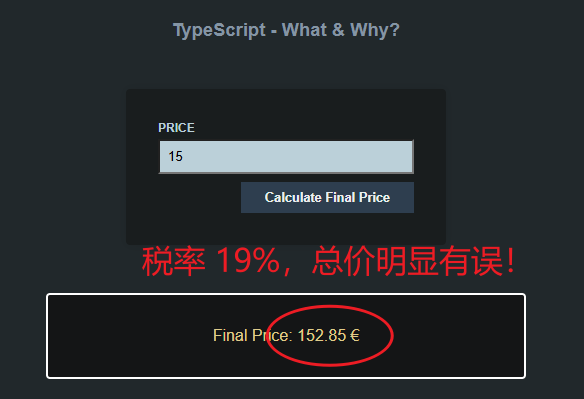
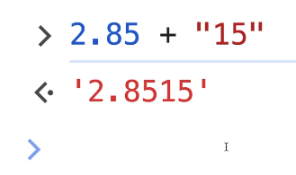

# L003 Why Would You Use TypeScript?

---

（重制版）

> [!tip]
>
> 代码详见 `code` 文件夹。


## 示例：计算税后价格

```js
function deriveFinalPrice(inputPrice) {
  const finalPrice = inputPrice + inputPrice * 0.19;
  const outputEl = document.getElementById('final-price');
  outputEl.textContent = 'Final Price: ' + finalPrice + ' €';
}

const formEl = document.querySelector('form');

formEl.addEventListener('submit', function (event) {
  event.preventDefault();
  const fd = new FormData(event.currentTarget);
  const inputPrice = fd.get('price');
  deriveFinalPrice(inputPrice);
});
```

实测效果：



报错原因：字符串拼接



用 `TypeScript` 约束类型即可：

```typescript
function deriveFinalPrice(inputPrice: number) {
  const finalPrice = inputPrice + inputPrice * 0.19;
  const outputEl = document.getElementById('final-price')!;
  outputEl.textContent = 'Final Price: ' + finalPrice + ' €';
}

const formEl = document.querySelector('form')!;

formEl.addEventListener('submit', function (event) {
  event.preventDefault();
  const fd = new FormData(event.currentTarget as HTMLFormElement);
  const inputPrice = fd.get('price')!;
  deriveFinalPrice(+inputPrice);
});
```

