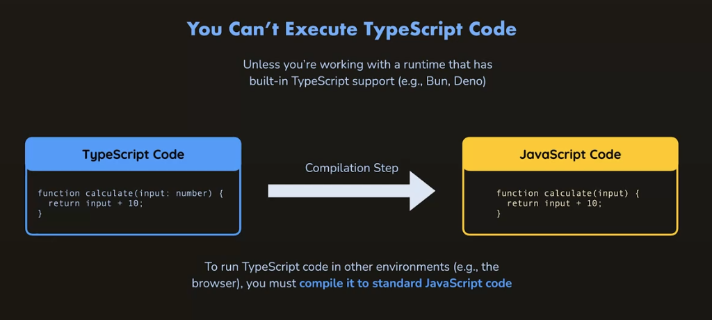
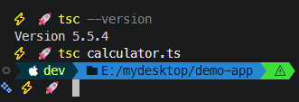

# L005 Installing & Using TypeScript

---

（重制版）


## 1 TypeScript 的短板

`TS` 无法直接在浏览器中运行（除非有个运行时环境内置了对 `TS` 的支持，例如 `Bun` 或 `Deno`）

`TS` 必须编译为标准的 `JS` 才能运行：




## 2 TypeScript 的安装

视频采用 `npm` 全局安装的方式：

- `NodeJS`：`v20.16.0`
- `TypeScript`：`v5.5`
- 安装命令：

```bash
# 原视频
npm install -g typescript
# 实际（与视频版本严格保持一致）
npm i -g typescript@5.5
```

编译 `TS` 文件（沿用第 `L003` 课代码）：

```bash
tsc calculator.ts
```

实测效果：


