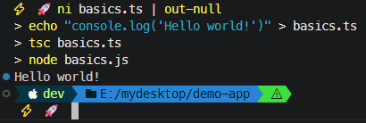
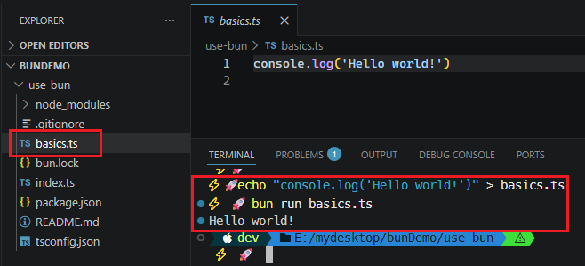

# L012 Project Setup

---


简化代码，突出 `TS` 重点：

```powershell
ni basics.ts | out-null
echo "console.log('Hello world!')" > basics.ts
tsc basics.ts
node basics.js
```

实测结果：



> [!tip]
>
> 实测 `Bun` 环境搭建
>
> ```bash
> bun init use-bun
> # 项目模板选 Blank（空白）
> cd use-bun
> echo "console.log('Hello world!')" > basics.ts
> bun run basics.ts
> ```
>
> 实测效果：
>
> 
