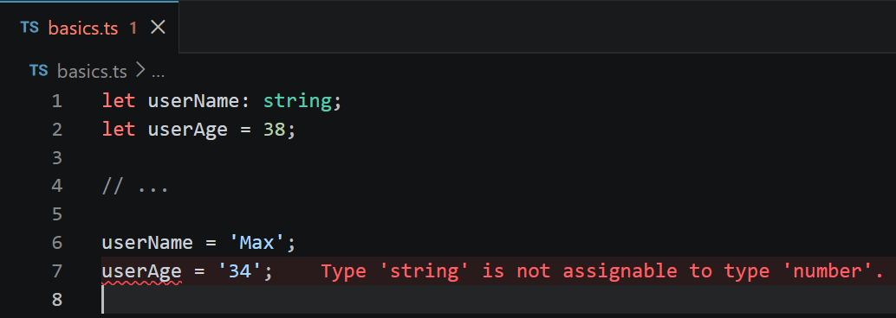

# L015 Type Inference vs Type Assignment

---


声明但未赋值，最好声明类型：

```ts
let userName: string;

// ...

userName = 'Max';
```

声明并赋初始值，则直接利用类型推断：

```ts
let userAge = 38;
// userAge = '34';
```

实测效果：




> [!tip]
>
> 截图中的错误信息提示格式来自 `VSCode` 热门插件 `Error Lens`。
