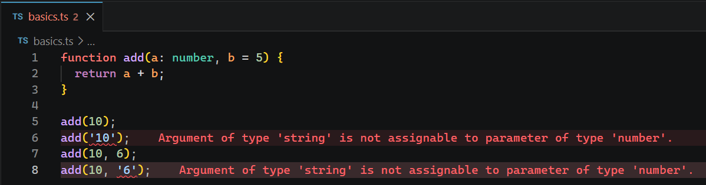

# L016 Assigning Types To Function Parameters

---


`TS` 可供声明类型的地方除了 **变量名**，还可以是 **函数**：

```ts
function add(a: number, b = 5) {
  return a + b;
}

add(10);
add('10');
add(10, 6);
add(10, '6');
```

实测效果：

