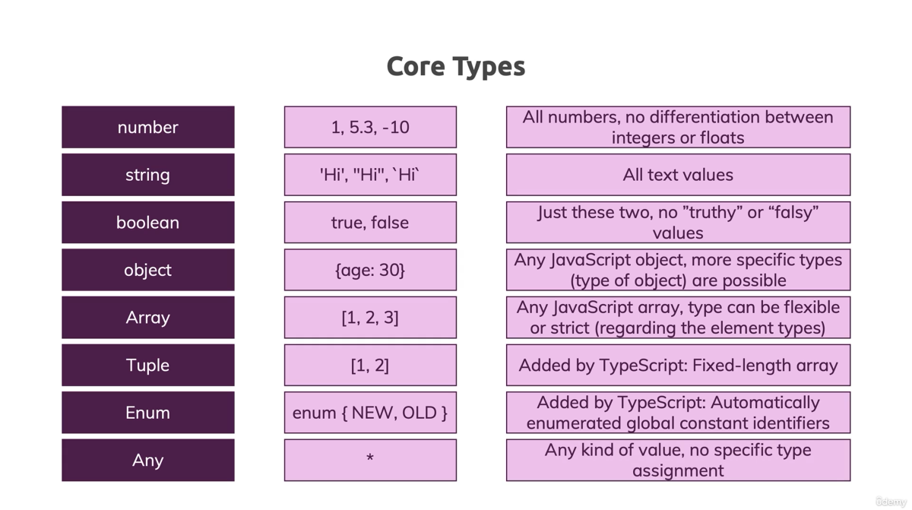

# L021 The "any" Type

`any` 型：类型可以为“任意”，看似灵活，实则损失了 `TypeScript` 提供的诸多便利，反而对开发及后期调式带来问题。

对于 `any` 型声明，能不用则 **尽量不用**

> **官网 `any` 的应用场景**
>
> The `any` type is useful when you don’t want to write out a long type just to convince TypeScript that a particular line of code is okay.
> （当您不想只是为了让 TypeScript 相信某行特定代码没问题而编写长类型时， `any` 类型非常有用。）

至此，`TypeScript` 支持的核心类型如下：

