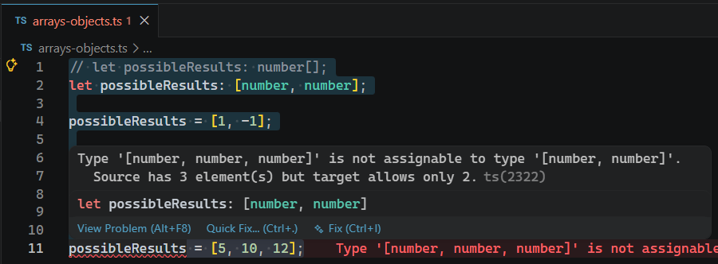

# L022 Making Sense of Tuples

---


元组的特点：数组长度、各元素的类型、以及元素的顺序必须严格一致

```ts
// let possibleResults: number[];
let possibleResults: [number, number];

possibleResults = [1, -1];
possibleResults = [5, 10, 12];
```

实测效果：


