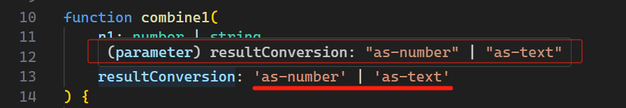

# L023 Literal Types


`literal` 型（字面常量型）衍生自 `union` 型，只不过类型不再是常见的数据类型，而是一个具体的 “字面量”：

```js
const weight = 2.8;
const flag = 'option1' | 'option2';
```


课程通过改造上节 `combine` 函数演示 `literal` 型的用法：

```ts
// original:
function combine(input1: number | string, input2: number | string) {
  let result;
  if(typeof input1 === 'number' && typeof input2 === 'number') {
    return input1 + input2;
  } else {
    return input1.toString() + input2.toString();
  }
}

// refactored:
function combine1(
    n1: number | string, 
    n2: number | string, 
    resultConversion: 'as-number' | 'as-text'
) {
    let result = combine(n1, n2);
    if(resultConversion === 'as-number') {
        return +result;
    } else {
        return result.toString();
    }
}
console.log(combine1(26, 30, 'as-number'));  // 56
console.log(combine1('26', '30', 'as-number'));  // 2630
```

利用 `VSCode` 的提示可以看到，`resultConversion` 的类型为 `literal` 型：



`literal` 型声明后，该参数的取值就只能是 `'as-number'` 和 `'as-text'` 了。一旦值不匹配，IDE 就会报编译错误。

其实这种情况下也可以采用 `enum` 枚举型；但候选词较少时，可以考虑用 `literal`。


附： `enum` 方案：

```ts
enum Flag { AS_NUMBER, AS_TEXT };
function combine2(
    n1: string | number,
    n2: string | number,
    resultConversion: Flag
) {
    let result = combine(n1, n2);
    if(resultConversion === Flag.AS_NUMBER) {
        return +result;
    } else {
        return result.toString();
    }
}

console.log(combine2(36, 30, Flag.AS_NUMBER));  // 66
console.log(combine2('36', '30', Flag.AS_NUMBER));  // 3630
```

