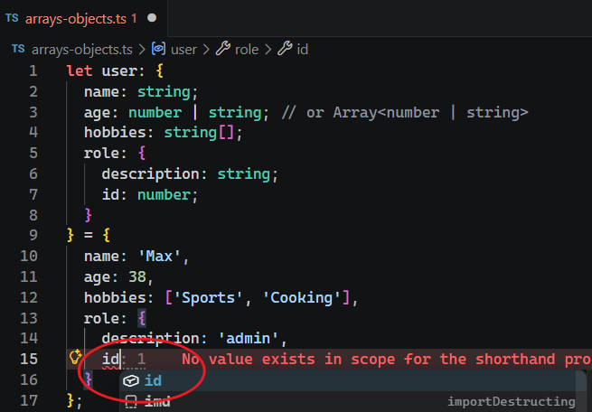

# L023 Object Types

---


`JS` 对象的类型声明和对象值的结构非常类似，最大的区别在于：

- `JS` 对象值中的键值对用逗号 `,` 分隔；
- 而 `TS` 类型中的键值对用分号 `;` 分隔。

```ts
let user: {
  name: string;
  age: number | string; // or Array<number | string>
  hobbies: string[];
  role: {
    description: string;
    id: number;
  }
} = {
  name: 'Max',
  age: 38,
  hobbies: ['Sports', 'Cooking'],
  role: {
    description: 'admin',
    id: 5
  }
};
```

声明对象类型后，赋值阶段 `VSCode` 可以获得对象字段的智能提示：


