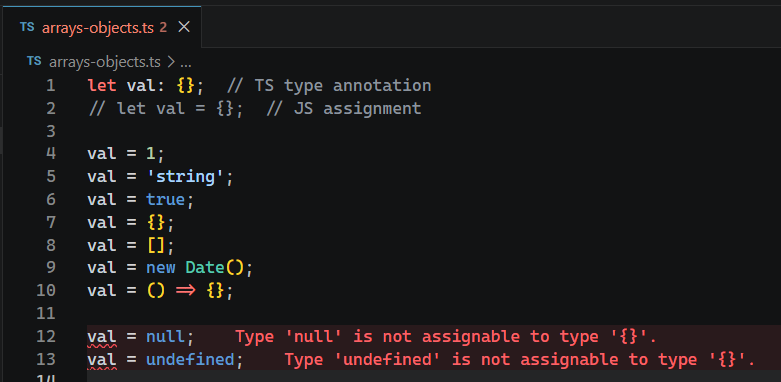

# L024 Tricky: The "Must Not Be Null" Type

---


这可能是 `TS` 中最古怪的一种类型声明：专门表示 **某个变量的值不为空的类型**（`null` 或 `undefined`）：

```ts
let val: {};  // TS type annotation
// let val = {};  // JS assignment

val = 1;
val = 'string';
val = true;
val = {};
val = [];
val = new Date();
val = () => {};

val = null;
val = undefined;
```

实测效果：



