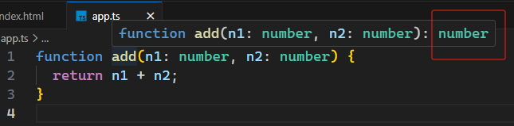

# L026 Function Return Types & "void"


函数的返回类型可以在参数列表后声明：

```ts
function add(n1: number, n2: number): number {
  return n1 + n2;
}
```

通常由TS自行推断，不用显式声明：




当函数没有返回值，函数类型则为 `void`：

```ts
function printResult(num: number): void {
  console.log("Result: " + num);
}
```

也可以写为 `undefined`：（不常用）

```ts
function printResult(num: number): undefined {
  console.log("Result: " + num);
}
```

视频中上述写法还会报错，实测发现该问题已修复（2023-11-14 08:58:43），说明这是一个 TS 早期的 Bug。

在 TS 中，`undefined` 也是一个合理的类型，但用得非常少：

```ts
let age: undefined;
age = void(0);
```

业界推荐的写法是 `void`


> `void` vs `undefined`
>
> 再次实测发现 `undefined` 在某种情况下依然会报错：
>
> ```ts
> // 1. OK
> function printResult(num: number): void {
>       console.log("Result: " + num);
>       return;
> }
> 
> // 2. OK
> function printResult(num: number): undefined {
>       console.log("Result: " + num);
>       return;
> }
> 
> // 3. OK
> function printResult(num: number): void {
>       return console.log("Result: " + num);
> }
> 
> // 4. error
> function printResult(num: number): undefined {
>       return console.log("Result: " + num);  // Type 'void' is not assignable to type 'undefined'.ts(2322)
> }
> ```
>
> 