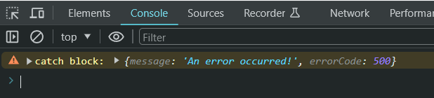

# L030 The "never" Type


`TypeScript` 还有一种特殊的类型：`never`

```ts
function generateError(message: string, code: number): never {
  throw { message: message, errorCode: code };
}
// Test1:
console.log(generateError("An error occurred!", 500));  // no undefined appear
```

`never` 不同于 `void`，不会返回任何值，包括 `undefined`。它实际上中断了正常执行逻辑，将控制权提前返回了。

中断逻辑示例：

```ts
try {
  const ret = generateError("An error occurred!", 500);
  console.log("ret:", ret);
} catch (error) {
  console.warn("catch block:", error);
}
```

执行结果：



由于 L2 抛出异常，控制权直接跳到 L5，因此 L3 将永远不被执行。

虽然 `TypeScript` 类型推断该函数返回的类型为 `void`，但手动声明为 `never` 更恰当。

除了 `throw` 外，人为的 `while` 死循环也会对应 `never` 型。但毕竟是人为错误，因此这种情况出现得很少。
