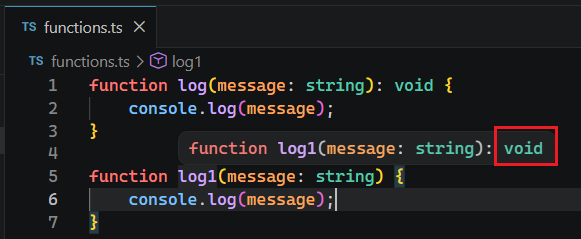

# L030 The "void" Type

---


`void` 类型主要用于限定函数返回值的类型，即返回值为 `undefined` 的情况：

```ts
function log(message: string): void {
    console.log(message);
}
```

由于 `void` 也是函数返回值类型的其中一员，因此也可以通过推断自动确定：



