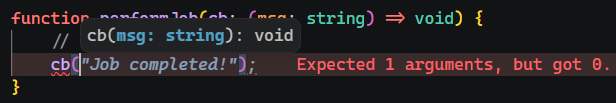

# L032 Functions as Types

---


当函数本身作参数时，又该如何声明参数类型呢？

```ts
function performJob(cb) {
  // ...
  cb();
}
```

:one: 一种方案是用 `Function` 类型声明：

```ts
function performJob(cb: Function) {
  // ...
  cb();
}
```

这样未免太过笼统。


:two: 使用函数类型声明

更恰当的方案是使用函数类型声明，具体限定参数类型及返回类型：

```ts
function performJob(cb: (msg: string) => void) {
    // ...
    cb("Job done!");
}
```

注意：函数类型中的参数名最好具有良好的描述性，这样 `IDE` 可以提示得更加智能：



具体传参时，真实函数的参数名称 **不必** 和类型声明保持一致，**只要类型满足要求即可**：

```ts
function log(message: string): void {
  console.log(message);
}

function performJob(cb: (msg: string) => void) {
  // ...
  cb("Job done!");
}

performJob(log);
```


函数类型在 `JS` 对象属性上的应用（`L4`）：

```ts
type User = {
  name: string;
  age: number;
  greet: () => string;
};

let user: User = {
  name: 'Max',
  age: 39,
  greet() {
    console.log('Hello there!');
    return this.name;
  }
}

const greeting = user.greet();  // Hello there!
console.log(greeting);  // Max
```

