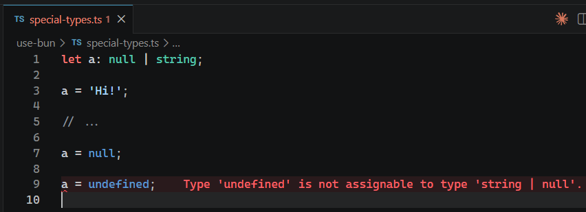

# L033 null & undefined - Special Types

---


`null` 和 `undefined` 是另两个和函数类型无关的类型。声明后表示该变量的值只能为 `null` 或 `undefined`。

适用场景：和其他常规类型联立——

```ts
let a: string | null;

a = 'Hi!';

// ...

a = null;
```

常用于主动释放内存的场景（设为 `null` 或 `undefined`）；或者用于 `API` 接口响应数据的类型声明。

实测效果：


