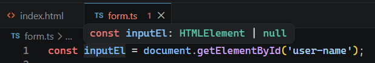
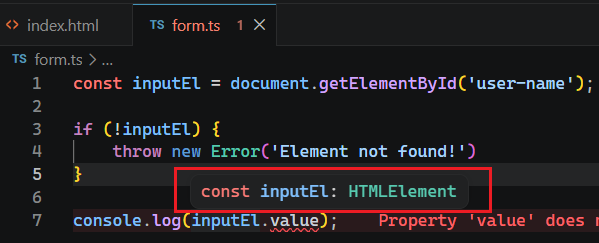

# L034 Inferred null & A First Look At Type Narrowing

---


本节通过一个文本框的引用，介绍了 `TS` 中的类型窄化（`Type Narrowing`）：

示例 `HTML` 页面：

```html
<!doctype html>
<html lang="en">
  <head>
    <meta charset="UTF-8" />
    <meta name="viewport" content="width=device-width, initial-scale=1.0" />
    <title>TypeScript!</title>
    <script src="form.js" defer></script>
  </head>
  <body>
    <p>
      <label>Your name</label>
      <input type="text" id="user-name" />
    </p>
    <button>Submit</button>
  </body>
</html>
```

其中 `form.js` 通过编译 `form.ts` 得到：

```ts
// form.ts
const inputEl = document.getElementById('user-name');

if (!inputEl) {
    throw new Error('Element not found!')
}

console.log(inputEl.value);
```

经过 `IDE` 内置的类型推断，`L2` 的类型为 `HTMLElement | null`；

加入非空判定后，`L8` 的推断类型窄化为 `HTMLElement`。

实测效果：

窄化前：



窄化后：


