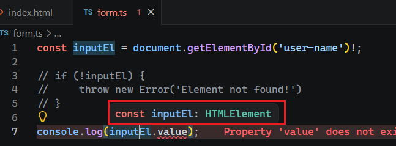
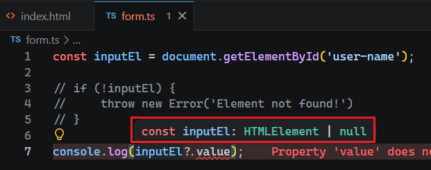

# L035 Forced "Not Null" And Optional Chaining

---


除了用 `if` 语句显式判定非空来实现变量类型的窄化外，还有两种变通方案。


## 1 强制视为非空

即添加 `!`，例如 `L1`：

```ts
const inputEl = document.getElementById('user-name')!;

// if (!inputEl) {
//     throw new Error('Element not found!')
// }

console.log(inputEl.value);
```

效果和 `if` 非空判定类似：




## 2 可选链操作符

即添加 `?`，例如 `L7`：

```ts
const inputEl = document.getElementById('user-name');

// if (!inputEl) {
//     throw new Error('Element not found!')
// }

console.log(inputEl?.value);
```

可选链操作符（**Optional Chaining**）不是 `TypeScript` 的专属特性，而是 `JavaScript` 从 `ES2020` 后引入的新语法特性，因此不具备类型窄化：

