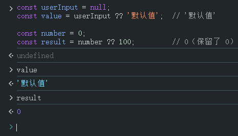
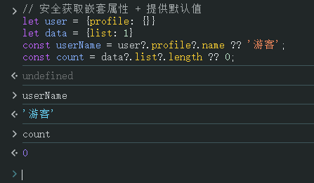
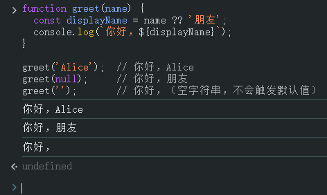

# L039 Nullish Coalescing

---


**Nullish Coalescing Operator**（空值合并操作符）用 `??` 表示，是 **ES2020**（与 Optional Chaining 同一版本）引入的另一个重要特性。

## 核心作用

**为 `null` 或 `undefined` 的值提供默认值**。只有当左侧的值是 `null` 或 `undefined` 时，才会返回右侧的默认值。

例如：

```ts
let input = '';
const didProvideInput = input ?? false;  // 结果为 ''
```


## 常见使用场景

以下为 `DeepSeek` 提供的拓展内容：

:one: 提供默认值

```js
const userInput = null;
const value = userInput ?? '默认值';  // '默认值'

const number = 0;
const result = number ?? 100;         // 0（保留了 0）
```

实测效果：




:two: 与可选链操作符配合使用

```js
// 安全获取嵌套属性 + 提供默认值
let user = {profile: {}}
let data = {list: 1}
const userName = user?.profile?.name ?? '游客';
const count = data?.list?.length ?? 0;
```

实测效果：




:three: 函数参数默认值

```js
function greet(name) {
  const displayName = name ?? '朋友';
  console.log(`你好，${displayName}`);
}

greet('Alice');  // 你好，Alice
greet(null);     // 你好，朋友
greet('');       // 你好，（空字符串，不会触发默认值）
```

实测效果：

