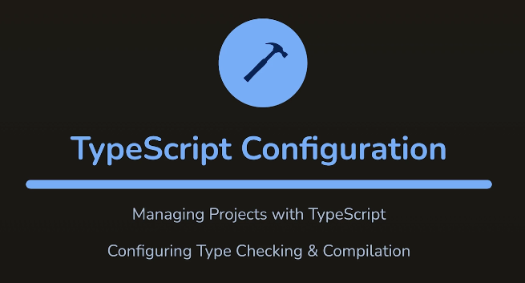

# L040 Module Introduction

---

对单个文件（`app.ts`）每次手动执行 `tsc` 编译命令 **很不方便**，本章重点讲解 `TypeScript` 的编译与配置。

> [!tip]
>
> 使用版本：
>
> - `NodeJS`：`v20.16.0`
> - `TypeScript (tsc)`：`v5.5.4`
> - `BunJS`：`v1.1.2`（与 `NodeJS` 版本保持一致）