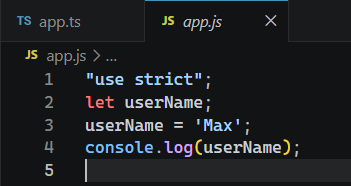

# L042 Exploring tsconfig Options: Target & Libs

---


本节概述了 `compilerOptions`（编译器选项）的基本结构和子模块 `Projects` 和 `Language and Environment` 的基本用法。


## 1 Projects 模块

位置：`compilerOptions::Projects`

该模块为高级项目配置，普通项目很少用到。

以 `disableReferencedProjectLoad` 为例，用于 **控制是否自动加载项目引用（Project References）中引用的其他项目**。

默认值：`false`。

改为 `true` 后，`TS` 将不会自动加载 `references` 字段中指定的项目。例如：

```json
// 主项目 tsconfig.json
{
  "compilerOptions": {
    "composite": true
  },
  "references": [
    { "path": "./shared" },
    { "path": "./utils" }
  ]
}
```

当 `disableReferencedProjectLoad: true` 时：

- `TypeScript` 会**忽略** `references` 数组；
- 不会加载 `./shared` 和 `./utils` 项目；
- 这些项目中的类型定义、源代码将不可用。

**典型应用场景**

1. **提高性能**：大型 `monorepo` 中跳过不必要的项目加载，加快编译速度
2. **调试**：临时禁用部分项目引用，隔离问题
3. **特定环境**：某些工具或脚本只需要处理当前项目，不关心依赖


## 2 Language and Environment 模块

### 2.1 target

`target`：控制 `TS` 编译后的目标 `JS` 版本：

```json
{
  "compilerOptions": {
    "target": "es2022"
  }
}
```

实测发现，执行 `tsc app.ts` 仍未生效，原因是该命令并未加载当前项目的配置文件，此时仍按 `tsc` 默认配置编译（`ES5`）。

更正：

```bash
tsc
# Or
tsc --project 
```

实测效果：




### 2.2 lib

配置指定的类型库，例如 `L036` 手动指定的 `HTMLInputElement` 就来自类型库 `DOM`。可显式配置：

```json
{
  "compilerOptions": {
    "lib": ["DOM"],
  }
}
```


### 2.3 其他

其他配置后续课程会单独介绍（如 `experimentalDecorators`、`JSX` 相关配置等）。以 `JSX` 相关配置为例，这些配置通常与具体的项目类型有关（如 `React` 项目），通常无需逐一手动配置，利用 `Vite` 这样的构建工具就能直接加载对应模版的 `TS` 配置，十分方便。