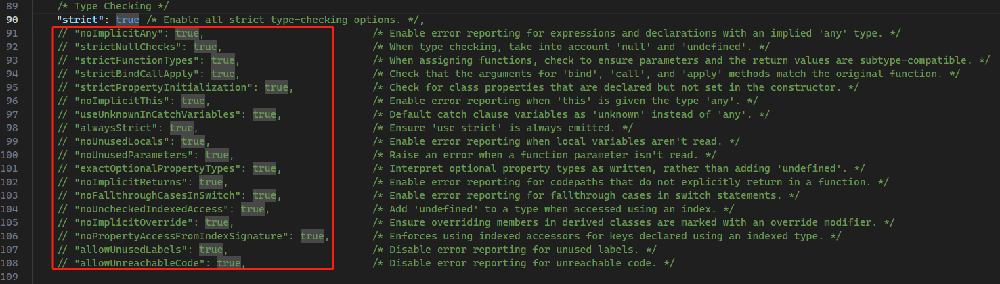

# L043 Strict Compilation
---

设置 `compilerOptions.strict` 为 `true` 相当于设置了一组与严格模式相关的具体配置：（实测时数量比视频多了一倍）



具体配置项选讲：

- `noImplicityAny`：禁止 TS 推断类型为 `any` 型（默认），除非显式声明为 `any`。
- `strictNullChecks`：如果变量没有非空校验逻辑，则报错。例如，检测一个 `button` 按钮元素是否为空。
- `strictFunctionTypes`：严格检查函数的参数、返回值的类型是否和声明一致
- `noImplicitThis`：`this` 指代不清而被推断为 `any` 型时报错
- `alwaysStrict`：在编译后的 JS 文件首行使用 `"use strict";` 标识的 **严格模式**
- `strictPropertyInitialization`：检查在构造函数中声明、但未设置的类属性
- `strictBindCallApply`：严格检查 `bind`、`call`、`apply` 的写法。

例如，给按钮点击事件绑定一个自定义传参逻辑：

```ts
const button = document.querySelector("button");
const clickHandler = (message: string) => console.log("Clicked! " + message);
if (button) {
  let msg = "Hello World!";
  button.addEventListener("click", clickHandler.bind(null, msg));
}
```

第 6 行就不能写成 `button.addEventListener("click", clickHandler.bind(null));`，因为按定义，必须传入一个 `message` 参数

这里也不能使用 `call` 或 `apply`，因为需要的是一个 **函数签名**，而不是 **函数的执行**。

