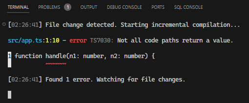

# L044 Code Quality Options
---

重点介绍了三个和代码质量相关的配置项：

1. `noUnusedLocals`：本地变量未使用，则编译不通过。
2. `noUnusedParameters`：函数参数未使用，则编译不通过。
3. `noImplicitReturns`：函数体内的所有分支必须手动补全 `return` 返回值，否则编译报错

`noImplicitReturns` 示例：

```ts
function handle(n1: number, n2: number) {
  if (n1 + n2 >= 0) {
    return n1 + n2;
  } else {
    console.log("Result is negative!");
  }
}
```

编译时报错：


