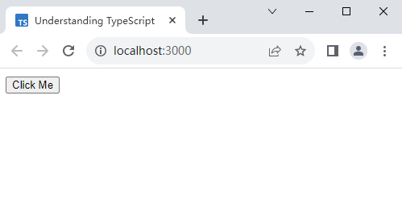
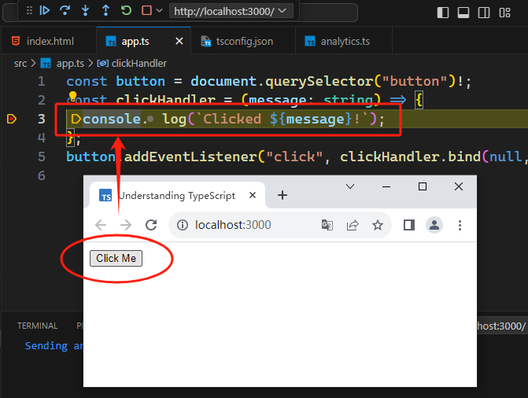

# L045 Debugging with Visual Studio Code
---

前置插件：

- `Debugger for Chrome`（已过时）

过时插件已更新为 `JavaScript Debugger`

调试实操：

1. 准备工作：

   1. 安装插件 `JavaScript Debugger`；

   2. 全局安装本地服务工具 `serve`：`npm i -g serve`（实测版本：v14.2.1）

   3. 打开 TS 源码映射：`{"compilerOptions": { "sourceMap": true }} `

   4. 测试代码：

      ```ts
      // src/app.ts
      const button = document.querySelector("button")!;
      const clickHandler = (message: string) => {
        console.log(`Clicked ${message}!`);  // breakpint here
      };
      button.addEventListener("click", clickHandler.bind(null, "You're welcome!"));
      ```

2. 编译示例项目：`tsc -w`

3. <kbd>F5</kbd> 启动调试模式，默认打开一个调试命令行（`JavaScript Debug Terminal`）；

4. 启动本地服务：`serve`

5. 访问本地服务：`http://localhost:3000`

6. 点击测试按钮（`Click Me`）：

   

7. 查看 `VSCode` 调试栏：（自动定位到断点位置，后续操作与 `Chrome DevTool` 类似）

   


更多配置，详见 [插件 GitHub 文档](https://github.com/microsoft/vscode-js-debug)
